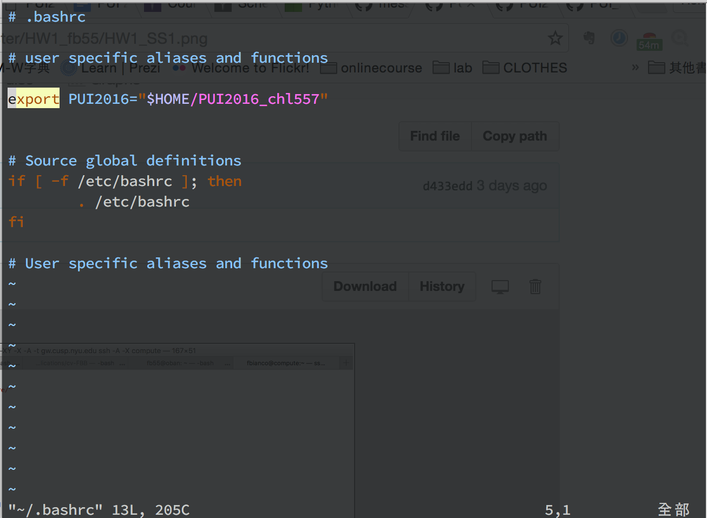
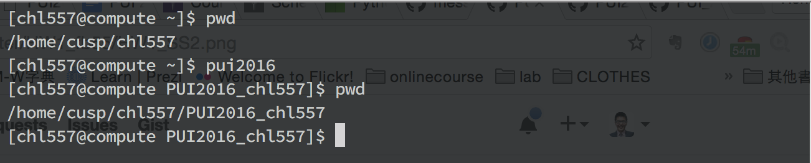

# PUI__HW1__chl557

HW1 can be divided into three sections:

The first one is screenshot for PUI_2016 settings and the screenshot are attached below!
HW1_SS1 => screenshot for PUI_2016 settings.

The second one is screenshot for how pui2016 works, which is also attached here: 

HW1_SS2 => screenshot for how pui2016 works

The final one is the ipython notebook. I git clone @fedhere 's repo and then cp the file to my repo.
After completed the notebook, I also rendered it so TA can see the result.