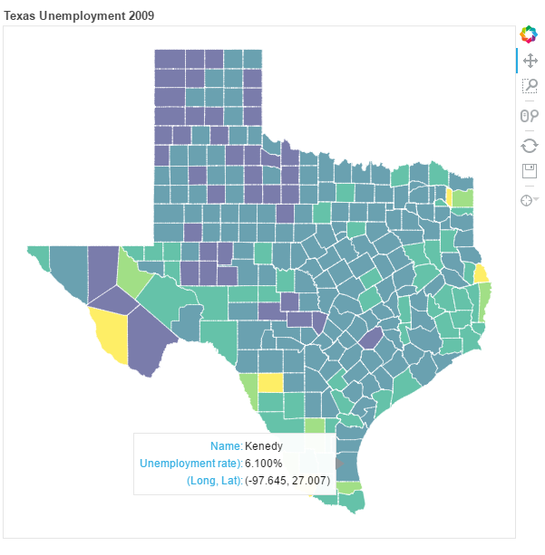

### Plot Review
Sooooo, you just made 10 different plots in two different notebooks. Thanks for making my life easy! Anyways I'm just going to look into one of the plots, not all 10. I'll review the one about unemployment in Texas as it happened to be the first plot in the first notebook I opened.

The url for the full effect: http://nbviewer.jupyter.org/github/henrilin28/PUI2016_chl557/blob/master/HW7_chl557/Visualization%20Fun.ipynb

The title of the plot could be a little bigger making it more proportional to the size of the plot. Also the title should state the granularity of the map (I guess we are looking at conties in Texas here but it's not stated anywhere so I can't be sure).

The map is missing a legend which would allow me to get familiar with unemployment in Texas faster than howering over the counties. I think a legend AND howering would make it a more complete map (the howering having more detailed data than the legend).

Citing the source of the data would be helpful for reproducibility purposes.

A little about the [10!] graphs in general: I think you could explain a little better what you are plotting in each plot with a descriptive title for the plots and by labeling the axis (some plots you do it, some plots not). But mostly your graphs look really impressive. Master, show me the way!

Best,
Keli.
