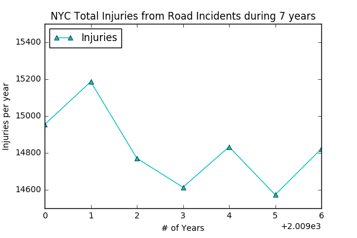

# Review for HW7 Plot by Henry Lin (chl557)

### Plot Author: Alexey Kalinin (ak6129) 
[Link to Github Repository](https://github.com/ak6129/PUI2016_ak6129/blob/master/HW7_ak6129/Assignment_1.ipynb)

## plot 

## Review

**CLARITY:** 
The plot is very clear to read and you use trangle to identify each point

**ESTHETIC:** 
I think the color is very readable. I engjoy light blue

**HONESTY:** 
The plot did visaulize the injuries per year but it is a little bit hard to tell the insight and the motivation of this plot.

Peer reviewer: Henry Lin (chl557)
