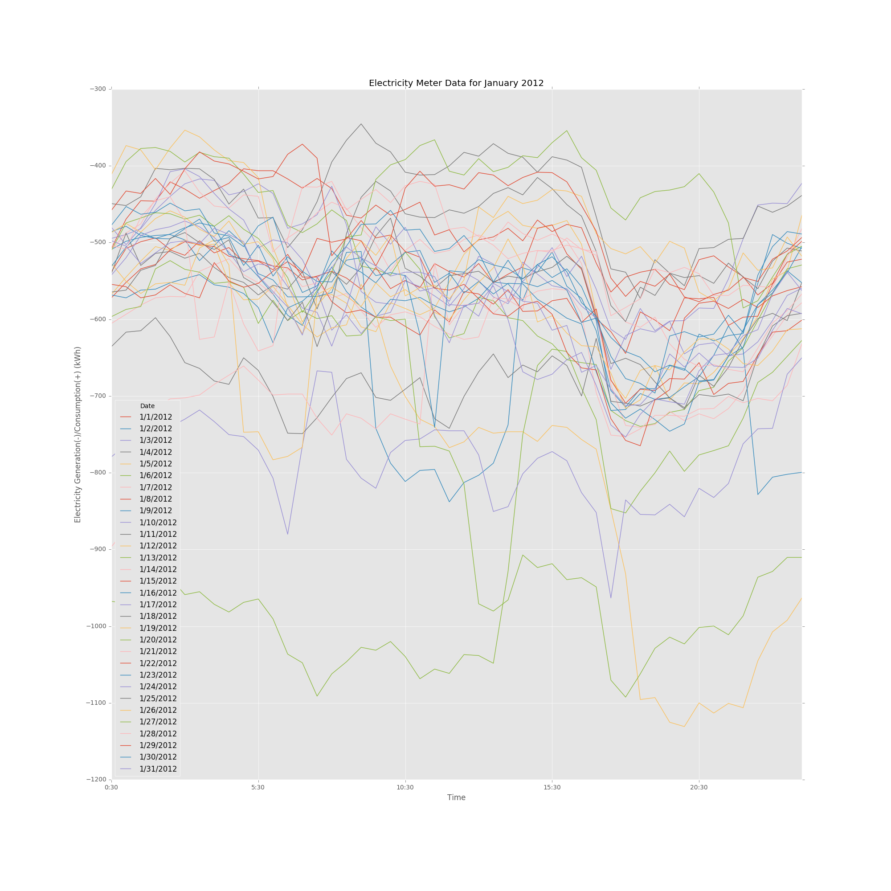

# Review for HW7 Plot by Henry Lin (chl557)

### Plot Author: Xinshi Zheng (xz1845) 
[Link to Github Repository](https://github.com/Henrilin28/PUI2016_xz1845/tree/master/HW7_xz1845)

## plot 

## Review

**CLARITY:** 
The plot has too many information to read. It is better to transform this time series lines in different format.

**ESTHETIC:** 
There are similar colors to represent the lines. For such a reason, it will be hard to identify the right line.

**HONESTY:** 
The plot did visaulize complicated information but it is hard to describe the result

Peer reviewer: Henry Lin (chl557)
